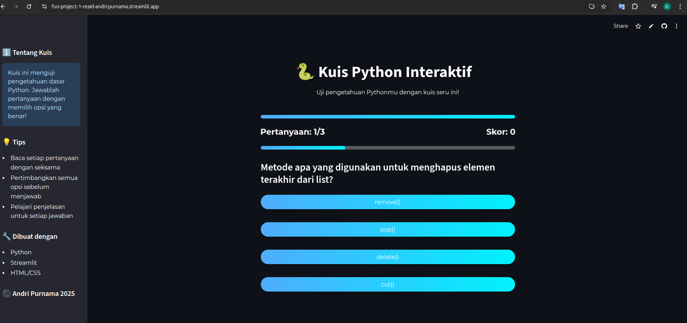
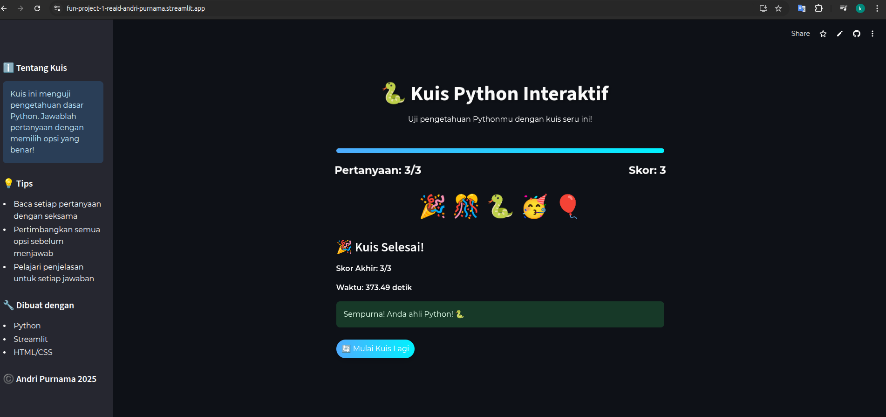

# Kuis Python Interaktif

ini adalah aplikasi fun project 1 REAID yang menggunakan bahasa pemrograman python dan css sederhana, dengan liberary streamlit.

## Screenshots

Halaman Utama

Hasil Skor


## Run Locally

Clone the project

```bash
  git clone https://github.com/khu9utsu/fun_project_1_REAID
```

Go to the project directory

```bash
  cd khu9utsu/fun_project_1_REAID
```

Install dependencies

```bash
  pip install streamlit
```

Start the server

```bash
  streamlit run app.py
```

## Demo

http://localhost:8501/

## Aplikasi

https://fun-project-1-reaid-andri-purnama.streamlit.app/
